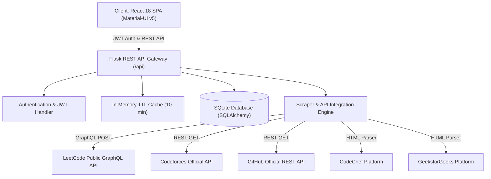

# 🚀 DevProfile.hub — Coding Profile Scrapper & Analytics

[](https://python.org)
[](https://flask.palletsprojects.com/)
[](https://reactjs.org/)
[](https://mui.com/)
[](https://www.docker.com/)
[](https://opensource.org/licenses/MIT)

> **DevProfile.hub** is a production-grade full-stack web application that unifies, visualizes, and tracks developer profiles across **LeetCode, Codeforces, GitHub, CodeChef, and GeeksforGeeks**. Built with a modular Flask REST API, SQLite persistence, in-memory TTL caching, and a responsive React (Material-UI) dashboard.

---

## 🌟 Key Features

- **⚡ Multi-Platform Integration**:
  - **LeetCode**: Official GraphQL API fetching live problem breakdown (Easy / Medium / Hard), global ranking, and contest rating.
  - **Codeforces**: Official REST API querying live contest rating, max rating, contribution, and rank titles (e.g., *Candidate Master*, *Specialist*).
  - **GitHub**: Official REST API aggregating public repositories, stargazers count, followers, and bio.
  - **CodeChef**: Resilient scraper parsing current division star rating (e.g., *3 Star*), global rank, and problems solved.
  - **GeeksforGeeks**: Real-time profile tracking for total score, problems solved, and institute rank.
- **🛡️ In-Memory TTL Caching**: Sub-50ms response times for repeated requests using a thread-safe 10-minute caching layer that prevents API rate limits and IP blocking.
- **👥 Peer Leaderboard & Head-to-Head Comparison**: Add friends to your network, rank each other on a live leaderboard, and launch an interactive side-by-side comparison modal with comparative progress bars.
- **🔒 Secure Authentication & Persistence**: SQLite database with SQLAlchemy ORM, password hashing using `werkzeug.security` (PBKDF2/SHA256), and JWT bearer token authorization.
- **🎯 1-Click Guest Demo**: Pre-configured demo login button so recruiters and portfolio reviewers can test live functionality instantly without typing credentials.
- **🌓 Glassmorphic Dark & Light Themes**: Tailored modern color palette with smooth elevation, linear progress meters, and responsive mobile drawer.
- **🐳 Containerized with Docker**: Spin up both frontend and backend with a single command: `docker compose up`.

---

## 🏗️ System Architecture



---

## 📁 Repository Structure

```
Coding-Profile-Scrapper/
├── backend/
│   ├── app/
│   │   ├── __init__.py           # Application factory & SQLite initialization
│   │   ├── models.py             # SQLAlchemy models (User, Friend)
│   │   ├── auth.py               # Password hashing & JWT decorator
│   │   ├── cache.py              # In-memory thread-safe TTL cache
│   │   ├── routes.py             # REST endpoints (auth, profiles, friends, leaderboard)
│   │   └── scrapers/
│   │       ├── __init__.py
│   │       ├── leetcode.py       # Official LeetCode GraphQL scraper
│   │       ├── github.py         # Official GitHub REST scraper
│   │       ├── codeforces.py     # Codeforces API scraper
│   │       ├── codechef.py       # CodeChef resilient parser
│   │       └── gfg.py            # GeeksforGeeks scraper
│   ├── requirements.txt          # Python dependencies
│   ├── run.py                    # Server entry point
│   ├── Dockerfile                # Backend container configuration
│   └── .env.example
├── frontend/
│   ├── src/
│   │   ├── api/
│   │   │   └── client.js         # Axios client with interceptors
│   │   ├── components/
│   │   │   ├── Navbar.js         # Responsive navigation & theme switcher
│   │   │   ├── MetricCard.js     # KPI summary cards
│   │   │   ├── PlatformCard.js   # Dynamic platform drilldown cards
│   │   │   ├── LeaderboardTable.js # Ranked peer leaderboard
│   │   │   ├── EditHandlesModal.js # Live handle verification & update
│   │   │   ├── AddFriendModal.js   # Add friend dialog
│   │   │   └── HeadToHeadModal.js  # Side-by-side comparison modal
│   │   ├── contexts/
│   │   │   └── AuthContext.js    # Global auth & session management
│   │   ├── pages/
│   │   │   ├── Login.js          # Tabbed auth & 1-click demo button
│   │   │   ├── Dashboard.js      # Main metrics & platform drilldown
│   │   │   └── LeaderboardPage.js# Peer comparison & leaderboard
│   │   ├── App.js                # Routing & Material-UI theme provider
│   │   └── index.js              # React 18 createRoot
│   ├── package.json
│   ├── Dockerfile                # Multi-stage Nginx production build
│   └── .env.example
├── docker-compose.yml            # Multi-container orchestration
├── .gitignore                    # Clean production gitignore
└── README.md
```

---

## 🔌 API Reference

| Method | Endpoint | Auth Required | Description |
| :--- | :--- | :---: | :--- |
| `GET` | `/api/health` | No | System health check and service status |
| `POST` | `/api/auth/register` | No | Register new user with hashed password & initial handles |
| `POST` | `/api/auth/login` | No | Authenticate user and receive JWT bearer token |
| `GET` | `/api/auth/me` | Yes | Retrieve profile details and handles for active session |
| `GET` | `/api/profiles` | Yes | Get cached multi-platform statistics & summary totals |
| `PUT` | `/api/profiles/handles` | Yes | Update user platform handles (invalidates cache) |
| `GET` | `/api/profiles/scrape/:platform/:handle` | No | Live test/verify username for any platform |
| `GET` | `/api/friends` | Yes | List all user friends with aggregated live stats |
| `POST` | `/api/friends` | Yes | Add friend to track and compare |
| `DELETE` | `/api/friends/:id` | Yes | Remove friend from tracker |
| `GET` | `/api/leaderboard` | Yes | Retrieve ranked leaderboard across user and peers |

---

## 🚀 Quick Start Guide

### Option 1: Docker (Recommended)

Run the entire stack with a single command:

```bash
docker compose up --build
```

- **Frontend**: Accessible at `http://localhost:3000`
- **Backend API**: Accessible at `http://localhost:5000`

---

### Option 2: Local Development

#### 1. Backend Setup

```bash
cd backend

# Create virtual environment
python -m venv venv

# Activate virtual environment
# Windows:
.\venv\Scripts\activate
# macOS/Linux:
source venv/bin/activate

# Install dependencies
pip install -r requirements.txt

# Start Flask API server (runs on port 5000)
python run.py
```

#### 2. Frontend Setup

In a new terminal:

```bash
cd frontend

# Install dependencies
npm install --legacy-peer-deps

# Start React development server (runs on port 3000)
npm start
```

---

## 🔑 Demo Access (For Reviewers)

To test the application without creating a new account:
1. Navigate to the login page (`http://localhost:3000/login`).
2. Click **"🚀 1-Click Guest Demo"** to log in instantly.
3. *Or use manual credentials*:
   - **Email**: `demo@portfolio.com`
   - **Password**: `demo123`

---

## 👨‍💻 Author

**Aditya Sinha**
- **GitHub**: [@adityasinha513](https://github.com/adityasinha513)
- **Portfolio**: Available on personal website

---

## 📄 License

This project is licensed under the [MIT License](LICENSE).
