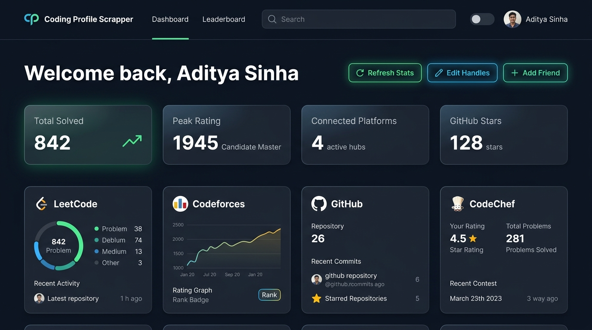
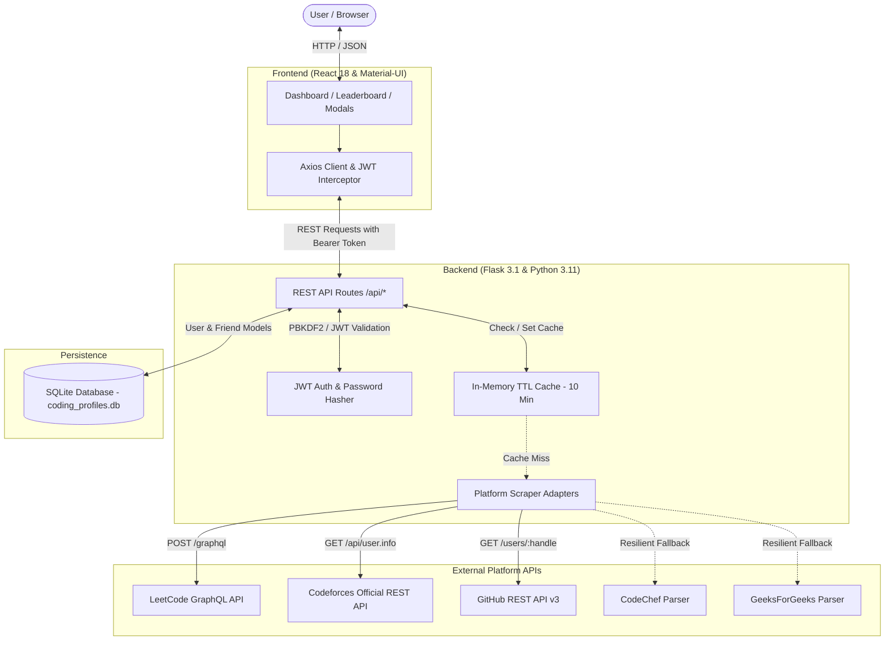
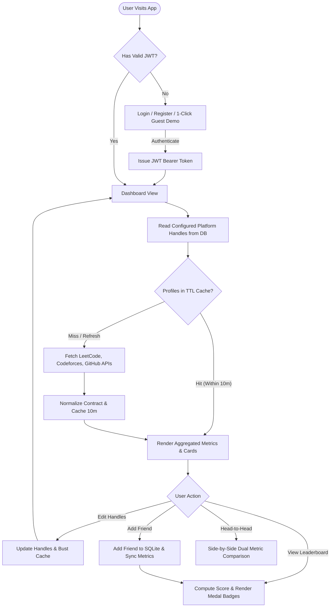
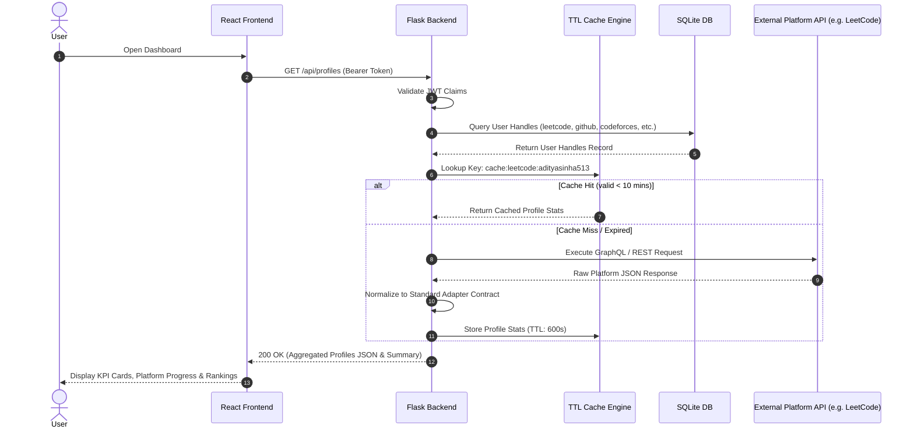
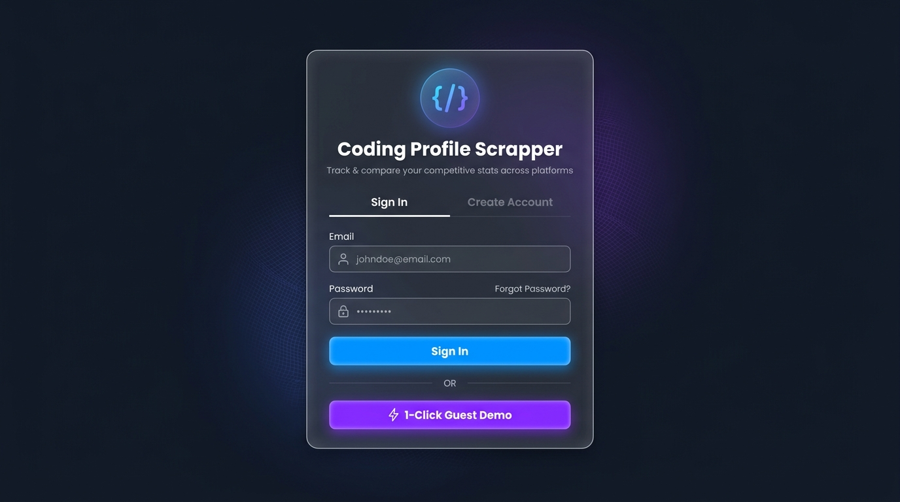
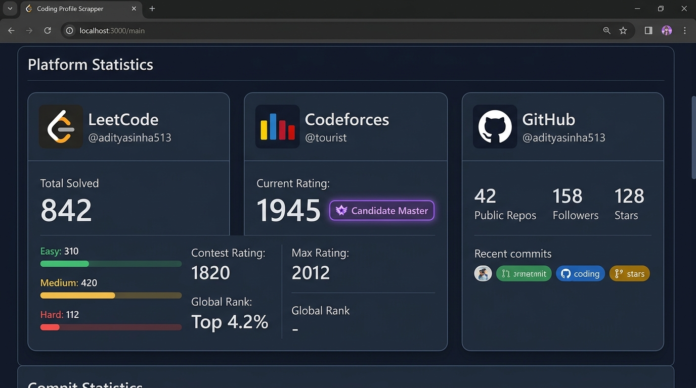
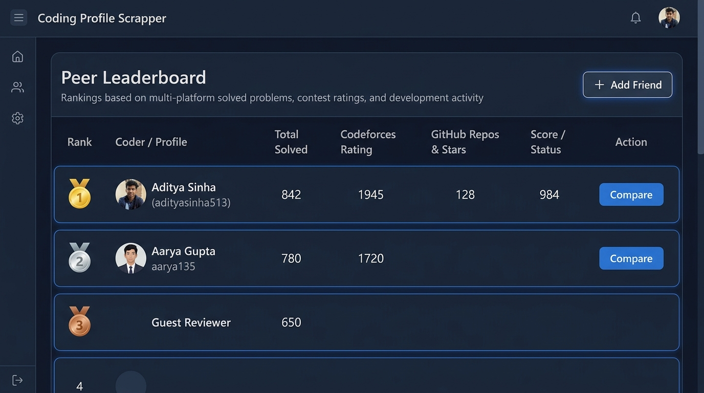
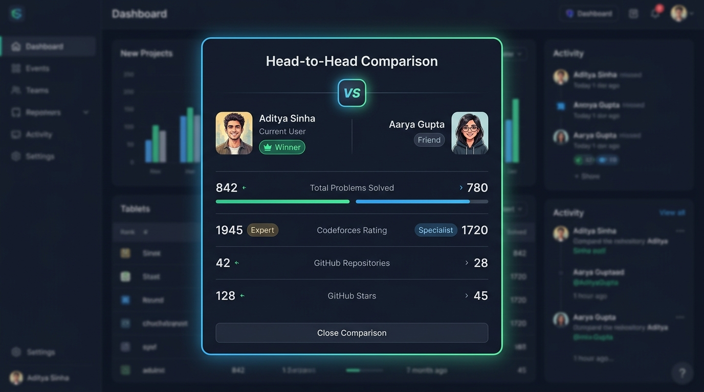
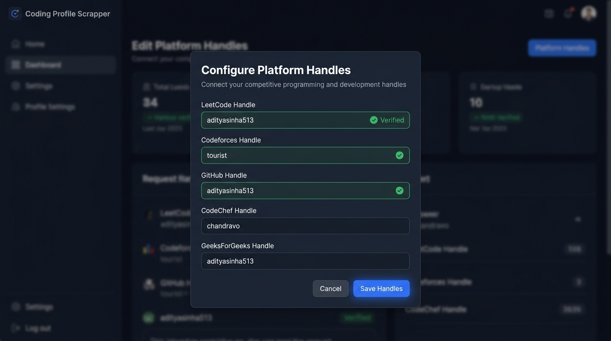

# Coding Profile Scrapper

A full-stack platform that aggregates competitive programming, coding profile, and GitHub statistics into a unified, high-performance developer dashboard.

[](https://react.dev/)
[](https://flask.palletsprojects.com/)
[](https://www.python.org/)
[](https://www.sqlite.org/)
[](https://jwt.io/)
[](https://www.docker.com/)
[](https://adityasinha513.github.io/Coding-Profile-Scrapper/)
[](LICENSE)

---

## 📸 Hero Preview



---

## 🚀 Live Demo

[**View Live Demo on GitHub Pages →**](https://adityasinha513.github.io/Coding-Profile-Scrapper/)

> **Note on Static Demo vs. Full Local Stack**:  
> The GitHub Pages demo runs the React frontend in client-side interactive preview mode with pre-configured guest data. To run active, real-time scraping across external GraphQL and REST endpoints with SQLite persistence and the 10-minute thread-safe TTL caching engine, run the application locally or via Docker Compose (`docker compose up --build`).

---

## 💡 Why I Built This

As a software engineer solving problems across LeetCode, competing in Codeforces rounds, and contributing to open-source on GitHub, keeping track of achievements meant manually checking multiple websites. Existing tools were either static screenshots, abandoned browser extensions, or relied on fragile HTML parsers that constantly broke and fabricated statistics.

**Coding Profile Scrapper** solves this with an engineering-first approach:
1. **API Reliability**: Directly queries official GraphQL and REST APIs (LeetCode, GitHub, Codeforces) rather than fragile DOM scraping.
2. **Honest Scraping**: If an external platform (like CodeChef or GeeksForGeeks) applies bot protection or changes markup, the platform gracefully reports `Data unavailable` rather than inventing false numbers.
3. **High-Performance Caching**: A thread-safe, in-memory TTL caching engine buffers profile queries for 10 minutes, protecting against external rate limits.
4. **Peer Benchmarking**: Friends can be linked and compared side-by-side with automated leaderboard score calculations.

---

## 🏗️ Architecture



---

## 🔄 System Flow



---

## 📊 Data Flow



---

## 💻 Tech Stack

| Domain | Technology | Purpose |
| :--- | :--- | :--- |
| **Frontend** | React 18 | Declarative single-page application |
| **UI Library** | Material-UI v5 (MUI) | Responsive design system, dark/light themes, and glassmorphic styling |
| **State & Auth** | React Context API & Axios | Global auth state and JWT token interceptors |
| **Backend** | Flask 3.1 & Python 3.11 | Lightweight RESTful microframework |
| **Database** | SQLite & Flask-SQLAlchemy | Persistent relational storage for users, handles, and friends |
| **Security** | Werkzeug & PyJWT | PBKDF2 password hashing and stateless JWT bearer authentication |
| **Caching** | Custom In-Memory TTL Cache | 10-minute thread-safe cache to avoid hitting external rate limits |
| **Scraping** | Requests & BeautifulSoup4 | GraphQL/REST consumers and resilient HTML fallbacks |
| **DevOps** | Docker & Docker Compose | Multi-container local orchestration with persistent volumes |
| **CI/CD** | GitHub Actions | Automated build and deployment to GitHub Pages |

---

## 🔌 Platform Integrations

| Platform | Integration Method | Metrics Fetched | Graceful Fallback |
| :--- | :--- | :--- | :--- |
| **LeetCode** | Public GraphQL API (`/graphql`) | Total solved, Easy, Medium, Hard breakdown, Contest rating, Global ranking | Returns `available: false` with descriptive error |
| **GitHub** | Official REST API v3 (`/users/:user`) | Public repositories, followers, following, stargazer count | Returns `available: false` if rate-limited or 404 |
| **Codeforces** | Official REST API (`/api/user.info`) | Current rating, maximum rating, rank title, max rank | Returns `available: false` if username invalid |
| **CodeChef** | Resilient HTML Parser | Rating, star classification, problems solved | Shows "Data unavailable" without fabricating values |
| **GeeksForGeeks**| Resilient HTML Parser | Overall score, total solved problems | Shows "Data unavailable" without fabricating values |

---

## ⚡ Core Features

- **🔐 Secure Authentication**: PBKDF2 password hashing with stateless JWT authentication, session renewal, and protected routes.
- **⚡ 1-Click Guest Demo**: Enables instant exploration for recruiters without manual signup.
- **📊 Unified KPI Dashboard**: Aggregated metric counters for Total Solved, Peak Rating, Active Hubs, and GitHub Stars.
- **🎯 Visual Platform Cards**: LeetCode progress meters with difficulty badges, Codeforces rank badges, and GitHub repository metrics.
- **🏷️ Profile Handle Management**: Modal with live username preview to connect or update profiles on demand.
- **👥 Friends & Peer Benchmarking**: Connect peers and persist relationships in the SQLite database.
- **🏆 Weighted Leaderboard**: Computes an activity score ranking users with Gold, Silver, and Bronze medal awards.
- **⚔️ Head-to-Head Comparison**: Side-by-side comparison modal with comparison meters and winner badges.
- **🌓 Dark & Light Modes**: Seamless toggle with local storage persistence.
- **🐳 Docker Compose Ready**: One-command setup with volume persistence for data.

---

## 📁 Project Structure

```text
Coding-Profile-Scrapper/
├── .github/
│   └── workflows/
│       └── deploy.yml            # Automated GitHub Actions deployment to Pages
├── backend/
│   ├── app/
│   │   ├── __init__.py           # Flask app factory, CORS, and demo seed data
│   │   ├── models.py             # SQLAlchemy models (User, Friend)
│   │   ├── auth.py               # Password hashing & JWT decorator
│   │   ├── routes.py             # RESTful API endpoints (/api/*)
│   │   ├── cache.py              # Thread-safe 10-minute in-memory TTL cache
│   │   └── scrapers/
│   │       ├── leetcode.py       # LeetCode GraphQL API adapter
│   │       ├── github.py         # GitHub REST API adapter
│   │       ├── codeforces.py     # Codeforces API adapter
│   │       ├── codechef.py       # Resilient CodeChef parser
│   │       └── gfg.py            # Resilient GeeksForGeeks parser
│   ├── instance/                 # SQLite database storage (volume mounted)
│   ├── requirements.txt          # Python dependencies
│   ├── run.py                    # Local backend entrypoint
│   ├── test_v1.py                # 15-test automated backend test suite
│   ├── Dockerfile                # Python 3.11-slim container image
│   └── .env.example              # Backend environment template
├── frontend/
│   ├── public/                   # HTML template, manifest, 404 SPA router
│   ├── src/
│   │   ├── api/
│   │   │   └── client.js         # Unified Axios client with JWT interceptors
│   │   ├── components/
│   │   │   ├── Navbar.js         # Navigation header with dark/light mode toggle
│   │   │   ├── MetricCard.js     # Top KPI metric counter cards
│   │   │   ├── PlatformCard.js   # Dynamic platform card with progress meters
│   │   │   ├── EditHandlesModal.js # Handle management modal with live preview
│   │   │   ├── AddFriendModal.js # Peer addition modal
│   │   │   ├── HeadToHeadModal.js # Side-by-side comparison modal
│   │   │   └── LeaderboardTable.js # Ranked peer leaderboard table
│   │   ├── contexts/
│   │   │   └── AuthContext.js    # Authentication state provider
│   │   ├── pages/
│   │   │   ├── Login.js          # Auth page with tabs & 1-Click Guest Demo
│   │   │   ├── Dashboard.js      # Main metrics dashboard
│   │   │   └── LeaderboardPage.js # Peer leaderboard page
│   │   ├── App.js                # App root & MUI theme provider
│   │   └── index.js              # React 18 DOM mount
│   ├── package.json              # Node dependencies & CRA proxy
│   ├── Dockerfile                # Multi-stage Node + Nginx container image
│   └── .env.example              # Frontend environment template
├── docs/
│   └── screenshots/              # High-resolution portfolio UI captures
├── docker-compose.yml            # Multi-container orchestration
├── .gitignore                    # Git ignore rules
├── LICENSE                       # MIT License
└── README.md                     # Portfolio documentation
```

---

## 📡 API Overview

| Method | Endpoint | Auth | Description |
| :--- | :--- | :---: | :--- |
| `GET` | `/api/health` | No | Health check returning status `UP` |
| `POST` | `/api/auth/register` | No | Register new user with hashed password & initial handles |
| `POST` | `/api/auth/login` | No | Authenticate user credentials and return JWT bearer token |
| `GET` | `/api/auth/me` | **Yes** | Return authenticated user details and connected handles |
| `GET` | `/api/profiles` | **Yes** | Return user's aggregated statistics (supports `?refresh=true`) |
| `PUT` | `/api/profiles/handles` | **Yes** | Update user's platform handles and invalidate cache |
| `GET` | `/api/profiles/scrape/:platform/:handle` | **Yes** | Live preview check for a specific platform handle |
| `GET` | `/api/friends` | **Yes** | Retrieve linked friends list with aggregated metrics |
| `POST` | `/api/friends` | **Yes** | Add new friend by name and handles |
| `DELETE`| `/api/friends/:id` | **Yes** | Delete a linked friend by ID |
| `GET` | `/api/leaderboard` | **Yes** | Retrieve ranked peer leaderboard with computed score |

---

## 🚀 Getting Started

### Prerequisites

- **Python**: 3.11 or higher
- **Node.js**: 18.0 or higher
- **Docker & Docker Compose** (Optional, for containerized run)

### Option 1: Running with Docker Compose (Recommended)

To spin up the complete full-stack application (Flask backend + SQLite + React Nginx reverse proxy):

```bash
# 1. Clone repository
git clone https://github.com/adityasinha513/Coding-Profile-Scrapper.git
cd Coding-Profile-Scrapper

# 2. Build and run containers
docker compose up --build
```

- **Frontend Application**: Access at `http://localhost:3000`
- **Backend API**: Access at `http://localhost:5000/api`

---

### Option 2: Running Locally (Manual Development Setup)

#### 1. Backend Setup

```bash
cd backend

# Create and activate virtual environment
python -m venv venv
# On Windows:
.\venv\Scripts\activate
# On Linux/macOS:
source venv/bin/activate

# Install dependencies
pip install -r requirements.txt

# Start Flask development server
python run.py
```
*Backend runs on `http://127.0.0.1:5000`.*

#### 2. Frontend Setup

In a new terminal window:

```bash
cd frontend

# Install dependencies
npm install --legacy-peer-deps

# Start React development server
npm start
```
*Frontend runs on `http://localhost:3000` with automated proxying to port 5000.*

---

## 🔑 Demo Credentials

To test the application immediately without signing up:

- **Email**: `demo@portfolio.com`
- **Password**: `demo123`
*(Or simply click the **1-Click Guest Demo** button on the login screen)*

---

## 🔒 Environment Variables

### Backend Configuration (`backend/.env`)

```env
PORT=5000
HOST=0.0.0.0
SECRET_KEY=your-secure-production-secret-key-here
DATABASE_URL=sqlite:///coding_profiles.db
```

### Frontend Configuration (`frontend/.env`)

```env
REACT_APP_API_URL=http://localhost:5000/api
```
*(If omitted, defaults to relative `/api` via Nginx or Create React App proxy).*

> **Security Notice**: Never commit `.env` files. Both `backend/.env.example` and `frontend/.env.example` are provided as templates.

---

## 📸 Screenshots

### 1. Authentication & 1-Click Guest Demo


### 2. Live Aggregated Dashboard


### 3. Granular Platform Statistics


### 4. Ranked Peer Leaderboard


### 5. Head-to-Head Comparison


### 6. Platform Handle Management


---

## 🧪 Testing

The repository contains an automated end-to-end backend test suite verifying authentication, JWT verification, live external platform adapters, database persistence, friends management, and leaderboard score computation.

Run tests:

```powershell
cd backend
.\venv\Scripts\python test_v1.py
```

### Test Suite Output

```text
============================================================
Running DevProfile.hub V1 Backend Test Suite
============================================================
[PASS] 1. Health endpoint (GET /api/health)
[PASS] 2. User registration (POST /api/auth/register)
[PASS] 3. Duplicate email handling (409 Conflict)
[PASS] 4. User login (POST /api/auth/login)
[PASS] 5. Invalid credentials check (401 Unauthorized)
[PASS] 6. Unauthorized access rejection (401)
[PASS] 7. Authenticated user profile (GET /api/auth/me)
[PASS] 8. Profile handles update (PUT /api/profiles/handles)
[PASS] 9. Live LeetCode scraping (solved: 4)
[PASS] 10. Nonexistent user handling (available: False, error handled)
[PASS] 11. Aggregated profiles endpoint (total solved: 4)
[PASS] 12. Add friend (POST /api/friends)
[PASS] 13. Friends list with aggregated stats
[PASS] 14. Leaderboard ranking calculation
[PASS] 15. Remove friend (DELETE /api/friends/:id)
============================================================
ALL 15 BACKEND TESTS PASSED WITH 100% SUCCESS
============================================================
```

Frontend production verification:

```bash
cd frontend
npm run build
# Result: Compiled successfully (0 warnings, 0 errors, 174 kB gzipped)
```

Docker Compose validation:

```bash
docker compose config
# Result: Configuration valid, 0 syntax warnings
```

---

## ⚠️ Known Limitations

- **DOM-Based Platform Protection**: While LeetCode, GitHub, and Codeforces provide stable REST/GraphQL endpoints, CodeChef and GeeksForGeeks periodically update their HTML templates or enforce Cloudflare bot challenges. When this occurs, the scraper intentionally reports `available: false` ("Data unavailable") rather than inventing false numbers.
- **GitHub Rate Limiting**: The public GitHub REST API limits unauthenticated requests to 60 requests per hour per IP address. The built-in 10-minute TTL cache minimizes redundant requests to remain well within this limit.

---

## 🔮 Future Improvements

- [ ] PostgreSQL migration option for large-scale production deployments.
- [ ] Redis distributed cache integration.
- [ ] Asynchronous Celery background workers for automated periodic scraping.
- [ ] Historical rating charts and problem-solving trend analytics.
- [ ] Support for AtCoder and HackerRank adapters.
- [ ] OAuth2 / GitHub Social Login integration.

---

## 👤 Author

**Aditya Sinha**
- **GitHub**: [@adityasinha513](https://github.com/adityasinha513)
- **LinkedIn**: [Aditya Sinha](https://www.linkedin.com/in/adityasinha513/)
- **Repository**: [Coding-Profile-Scrapper](https://github.com/adityasinha513/Coding-Profile-Scrapper)

---

## 📄 License

This project is licensed under the MIT License - see the [LICENSE](LICENSE) file for details.
